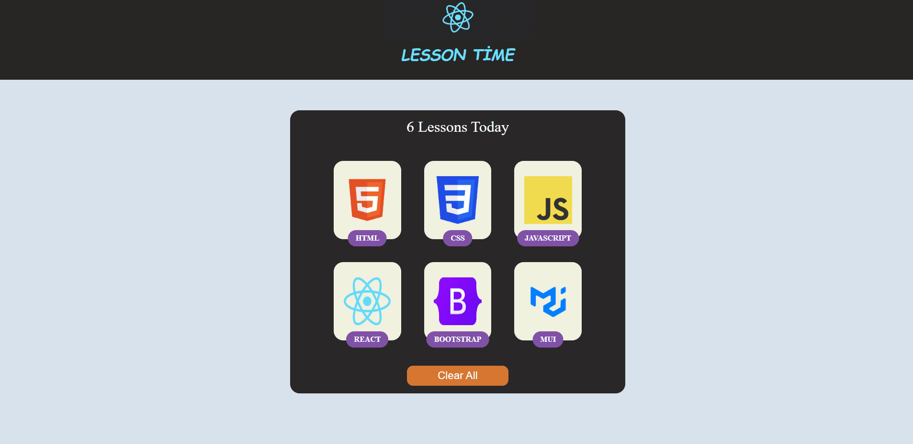

## Description
Basic project I developed while learning React(useState)

[Live](https://lessonscard-react-zlhshns-projects.vercel.app/)

## How does my project look

## Technologies
* React.js
* useState
* Scss/scss module

## How to install and run
In the project directory, you can run:

### `npm install`    `npm start`
OR
### `yarn install`    `yarn start`
